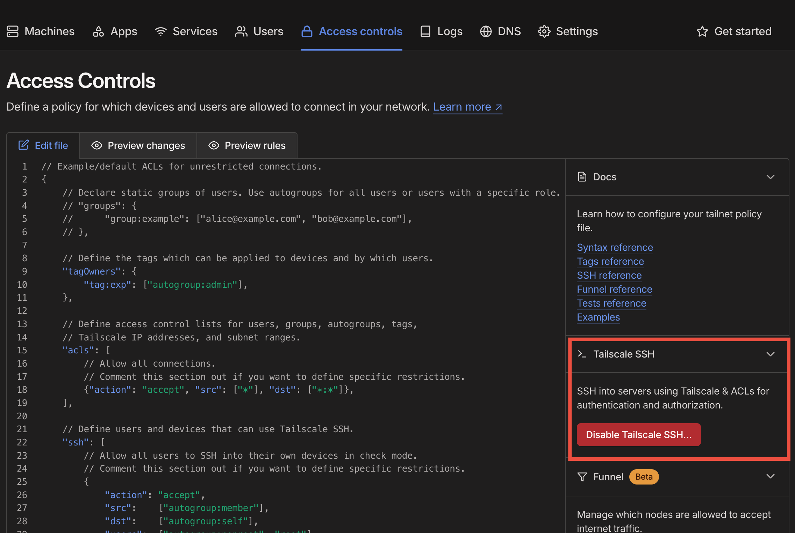

## Introduction to Tailscale

Tailscale is a zero-config VPN solution that allows you to connect to your servers securely and easily. With Tailscale, you can access your servers from anywhere, without the need for complex network configurations or VPN setups.

# Connect to Server

## Installation

To install Tailscale on your device, follow these steps:

1. Go to the [Tailscale website](https://tailscale.com/) and click on the "Download" button.
2. Select your device type and follow the installation instructions. (For macOS users, you may need a US Apple ID to download it from the App Store.)
3. Once installed, launch the Tailscale app and sign in with your Tailscale account credentials.

## Connect to Servers

Once logged in, go to the Tailscale [**Admin console](https://login.tailscale.com/welcome).**


The red circle represents the device you want to connect to, and the purple circle represents your device. Make sure both devices are connected to the network.

Hover over the address of the device you wish to connect to,


Copy the second address, then you can connect to the server using SSH:

```jsx
ssh <USERNAME>@ubuntu-server.tail03772.ts.net
```

### Create account on server

Make sure to first create an account on the server.

```bash
sudo adduser <USERNAME>
```

That's all for users who want to connect to a server.

# Setting up a new server (Linux Only)

One command installation:

```bash
curl -fsSL <https://tailscale.com/install.sh> | sh
```

Run Tailscale:

```bash
tailscale up --advertise-tags=tag:<TAG> --ssh
```

<TAG> is used for control access, and `--ssh` enables SSH connection.

Once you set up the local server, manage access through the [Admin Panel](https://login.tailscale.com/welcome). Click the Access controls tab and make sure SSH is enabled.

To manage access, edit the .json file.

We only use the “ssh” section. For example:



The first block enables all users to connect their own devices through SSH. To manage others' access, edit the blocks below the first one.

For example, in the second block, “src” is your own machine, and “dst” is the destination server. Here we use the aforementioned <TAG> to manage access, but you can specify any server by the machine name.

For more details, please refer to [Tailscale SSH](https://tailscale.com/kb/1193/tailscale-ssh).

### Join to the Network

Contact the admins, then he will invite you into the network.

### Disable Key Expiry (Optional)


The last step is to disable expiry so you never need to reauthenticate.
